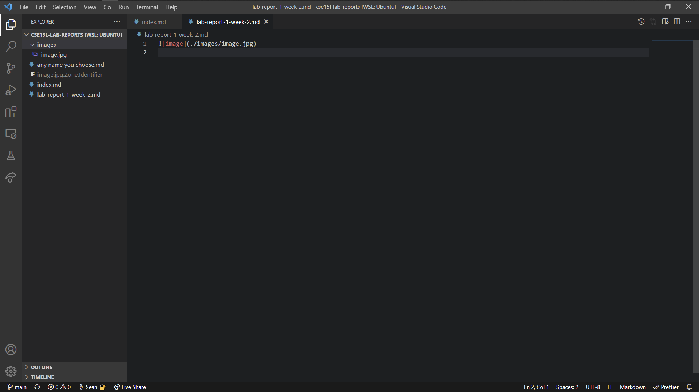
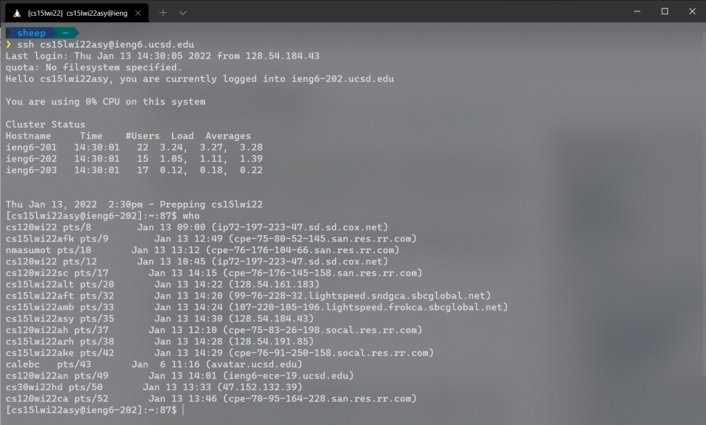

## Installing VS Code



I had already installed VS Code, and it has been a while, so I don't really
remember how I installed it. If I remember correctly, the installation process
was pretty painless; I probably went to https://code.visualstudio.com/, clicked
the big Download button, then followed the instructions from there.

## Remotely connecting



To remotely connect, first I got my course-specific account username from
https://sdacs.ucsd.edu/~icc/index.php: `cs15lwi22asy`. Then, I reset my password
there. Apparently, selecting "No" for "Change MyTritonLink password?" doesn't
work if you click the blue "Check Password" button; it unfortunately reset my
normal UCSD password. Instead, you have to focus on the "Confirm Password" text
field and press the enter key.

Then, in the terminal, I ran

```sh
$ ssh cs15lwi22asy@ieng6.ucsd.edu
```

Before I set up my SSH key, it would ask for my password. Before my password was
reset, it wouldn't accept my password, and after five failed attempts it kicks
me off.

## Trying some commands


Running `ls -lat` shows folders and files that weren't listed by the plain `ls`
command.

I used `cd` to navigate around between directories. `cd ~` brought me back home.

I wasn't able to do touch other people's folders, so these commands didn't work; they gave permission denied errors.

- `ls /home/linux/ieng6/cs15lwi22/cs15lwi22awh`
- `cp /home/linux/ieng6/cs15lwi22/public/hello.txt ~/`
- `cat /home/linux/ieng6/cs15lwi22/public/hello.txt`

Also, on the Discord, someone said the `who` command listed everyone else
connected to the remote server with their IP addresses.
