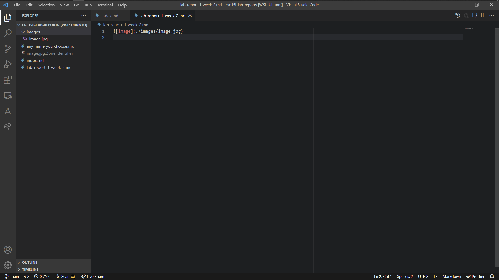
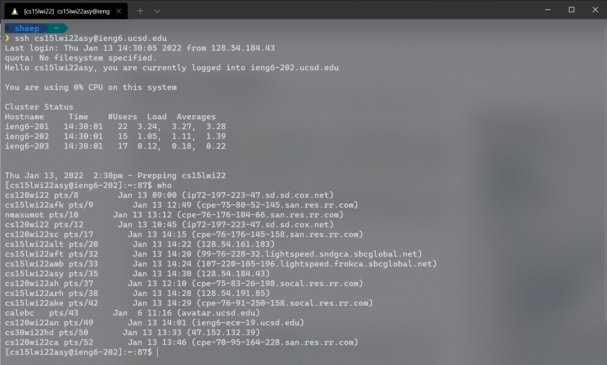
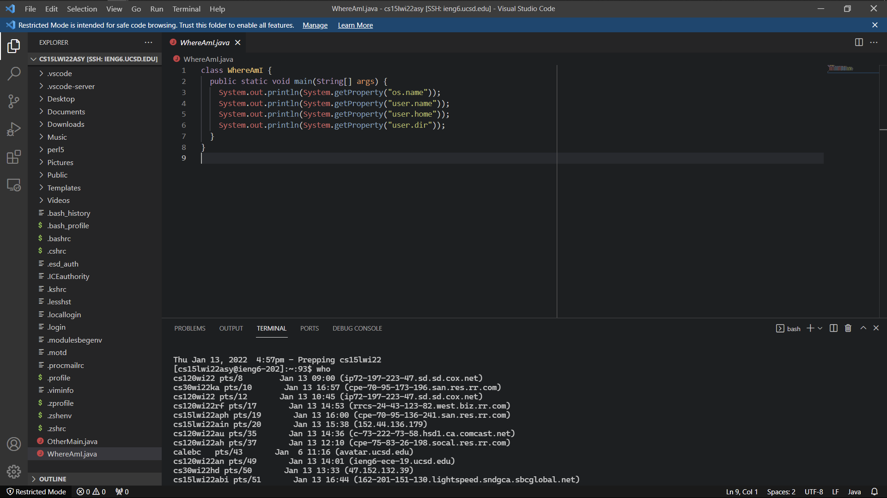

# Lab report 1

## Installing VS Code



I had already installed VS Code, and it has been a while, so I don't really
remember how I installed it. If I remember correctly, the installation process
was pretty painless; I probably went to <https://code.visualstudio.com/>, clicked
the big Download button, then followed the instructions from there.

## Remotely connecting



To remotely connect, first I got my course-specific account username from
<https://sdacs.ucsd.edu/~icc/index.php>: `cs15lwi22asy`. Then, I reset my
password there. Apparently, selecting "No" for "Change MyTritonLink password?"
doesn't work if you click the blue "Check Password" button; it unfortunately
reset my normal UCSD password. Instead, you have to focus on the "Confirm
Password" text field and press the enter key.

Then, in the terminal, I ran

```sh
$ ssh cs15lwi22asy@ieng6.ucsd.edu
```

Before I set up my SSH key, it would ask for my password. Before my password was
reset, it wouldn't accept my password, and after five failed attempts it kicks
me off.

`ssh` also accepts a command to run after the `<username>@<host>` part of the
command. Instead of starting an interactive shell, it just runs the command then
exits. Quotes should be used around the command to avoid any syntax ambiguities.

## Trying some commands


Running `ls -lat` shows folders and files that weren't listed by the plain `ls`
command.

I used `cd` to navigate around between directories. `cd ~` brought me back home.

I wasn't able to do touch other people's folders, so these commands didn't work; they gave permission denied errors.

- `ls /home/linux/ieng6/cs15lwi22/cs15lwi22awh`
- `cp /home/linux/ieng6/cs15lwi22/public/hello.txt ~/`
- `cat /home/linux/ieng6/cs15lwi22/public/hello.txt`

Also, on the Discord, someone said the `who` command listed everyone else
connected to the remote server with their IP addresses.

## Moving files with `scp`


To move files over SSH, I did `scp <files...> cs15lwi22asy@ieng6.ucsd.edu:~` on
my computer (not the server), where `~` is the target directory to copy the
files to. It overwrites existing files in the target directory. It can move
multiple files at once. Before I set my SSH key, it asked for my password.

## Setting an SSH key


_Observe how it doesn't prompt me for a password._

On my computer (as opposed to the server), I did

```sh
$ ssh-keygen
```

It gave me various prompts; I just pressed enter to skip them and use their
defaults.

Initially, I had set a passphrase for my SSH key to the same one I used for
logging in to the server because I thought it stores the password to
automatically log in; however, `ssh` still prompted me for the passphrase when I tried to log in. It turned out that I could just leave the passphrase empty, so I re-ran `ssh-keygen`.

This created a few files in the `.ssh` folder of my home directory. Then, I
copied the public key to the remote server using `scp`:

```sh
$ scp ~/.ssh/id_rsa.pub cs15lwi22@ieng6.ucsd.edu:~/.ssh/authorized_keys
```

I think this way, when I log in using `ssh`, it sees that I have a key on my
computer, so it sends the public key over to the server like an entry pass to
see if it's in its allowlist of keys that can be permitted in without a
password. Or maybe it works the other way around so that my computer can verify
the public key I gave the server with the private key I stored on my computer.

## Optimizing remote running



To make running code on the remote server even more pleasant, I set up VS Code
on the remote server. I followed [VS Code's directions for remote development
over SSH](https://code.visualstudio.com/docs/remote/ssh), which was pretty
painless. Now, I can directly edit and run programs remotely and see the file
system without having to rely completely on the command line.

One issue I had with this was that VS Code wasn't acknowledging my SSH key, so I
kept having to type my password. It turned out that VS Code was running on
Windows rather than in WSL, where I had my SSH keys stored. I just copied my
`.ssh` folder into my Windows home folder, which worked.
