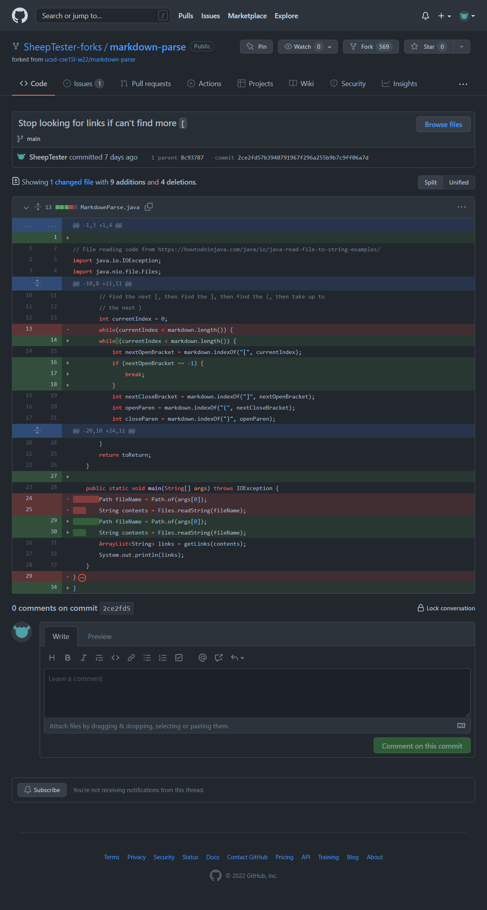
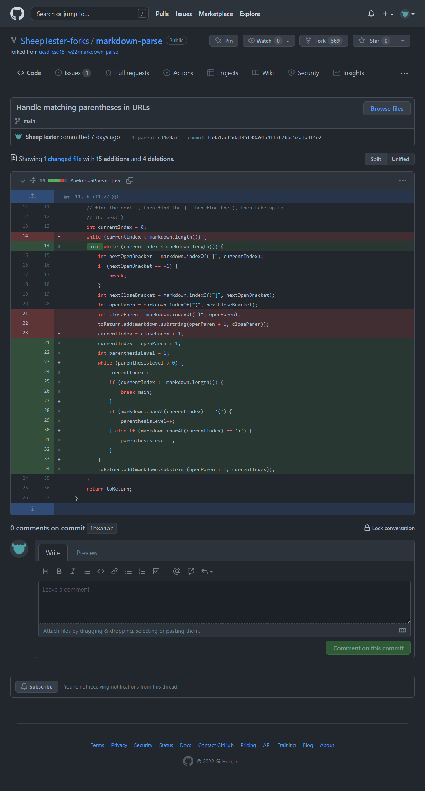

## Handling text after the last link



[basic-link.md](https://github.com/SheepTester-forks/markdown-parse/blob/main/basic-link.md)
is the failure-inducing input that prompted me to make that change.

I ran `java MarkdownParse.java basic-link.md`.

The symptom of the bug involved a short wait time for it to run, followed by an
uncaught runtime exception.

```
Exception in thread "main" java.lang.OutOfMemoryError: Java heap space
        at java.base/java.util.Arrays.copyOf(Arrays.java:3511)
        at java.base/java.util.Arrays.copyOf(Arrays.java:3480)
        at java.base/java.util.ArrayList.grow(ArrayList.java:237)
        at java.base/java.util.ArrayList.grow(ArrayList.java:244)
        at java.base/java.util.ArrayList.add(ArrayList.java:454)
        at java.base/java.util.ArrayList.add(ArrayList.java:467)
        at MarkdownParse.getLinks(MarkdownParse.java:18)
        at MarkdownParse.main(MarkdownParse.java:26)
```

The bug is that if `currentIndex` hadn't reached the last character of
`markdown`, the code would keep looking for links even when there weren't any
more; `markdown.indexOf("[", currentIndex)` would return -1, which brought
`currentIndex` back to the beginning. This effectively caused an infinite loop,
and since links are constantly being added to `toReturn`, the program eventually
ran out of memory, resulting in the OutOfMemoryError symptom.

The failure-inducing input caused this symptom by having a single newline
character after the link to prevent `currentIndex` from reaching the last
character of `markdown` after the end of the link.

## Handling parentheses in URLs



[weird-urls.md](https://github.com/SheepTester-forks/markdown-parse/blob/main/weird-urls.md)
is the failure-inducing input that prompted me to make that change.

I ran `java MarkdownParse.java weird-urls.md`.

The symptom of the bug was that the URL printed by the program omitted the
closing parenthesis. This disagreed with how VS Code and GitHub rendered the
link, which included the closing parenthesis in the URL.

```
[https://en.wikipedia.org/wiki/1984_(disambiguation]
```

It seems VS Code and GitHub _match_ closing parentheses, i.e. if there's a
opening parenthesis in the URL, its corresponding closing parenthesis also
belongs to the URL, as opposed to marking the end of the link URL.

For example, this Markdown link

<!-- prettier-ignore -->
```md
[Wikipedia disambiguation page on disambiguation](https://en.wikipedia.org/wiki/Disambiguation_(disambiguation)))
```

is rendered as

> [Wikipedia disambiguation page on disambiguation](<https://en.wikipedia.org/wiki/Disambiguation_(disambiguation)>))

with one closing parenthesis in the URL and a closing parenthesis as plain text
after the link.

The bug is that the program found the first instance of `)` after the opening
parenthesis of the link in the Markdown, rather than trying to pair these
parentheses, and took the contents in between the parentheses, excluding the
parentheses, as the URL of the link. This results in the symptom---the outputted
URL missing a closing parenthesis---because the program thought the closing
parenthesis in `(disambiguation)` was the closing parenthesis of the link.

The failure-inducing input caused the symptom by having a pair of parentheses in
the URL of a link.

## Ensuring nothing between the `]` and `(`


[test-file5.md](https://github.com/SheepTester-forks/markdown-parse/blob/main/test-file5.md)
is the failure-inducing input that prompted me to make that change.

I ran `javac -cp .:lib/junit-4.13.2.jar:lib/hamcrest-core-1.3.jar MarkdownParseTest.java && java -cp .:lib/junit-4.13.2.jar:lib/hamcrest-core-1.3.jar org.junit.runner.JUnitCore MarkdownParseTest`.

The symptom of the bug is in the test output.

```
JUnit version 4.13.2
...........E.....
Time: 0.018
There was 1 failure:
1) testTestFile5(MarkdownParseTest)
java.lang.AssertionError: expected:<[]> but was:<[page.com]>
        at org.junit.Assert.fail(Assert.java:89)
        at org.junit.Assert.failNotEquals(Assert.java:835)
        at org.junit.Assert.assertEquals(Assert.java:120)
        at org.junit.Assert.assertEquals(Assert.java:146)
        at MarkdownParseTest.testTestFile5(MarkdownParseTest.java:45)

FAILURES!!!
Tests run: 16,  Failures: 1
```

The symptom is that `getLinks` was returning `[page.com]` instead of an empty
list when given the contents of
[test-file5.md](https://github.com/SheepTester-forks/markdown-parse/blob/main/test-file5.md).

Running `java MarkdownParse.java test-file5.md` gives the following output.

```
[page.com]
```

However, VS Code and GitHub's markdown renderers don't render any links for [test-file5.md](https://github.com/SheepTester-forks/markdown-parse/blob/main/test-file5.md).

The bug is because the program did not check if `]` and `(` in a possible link
are adjacent. This caused the symptom because even though there was a paragraph
between the square bracket and the parenthesis, it still thought
`[stuff]...(page.com)` was a link and consequently added `page.com` to the list
of links.

The failure-inducing input caused the symptom by having content between the
closing bracket and the opening parenthesis.
