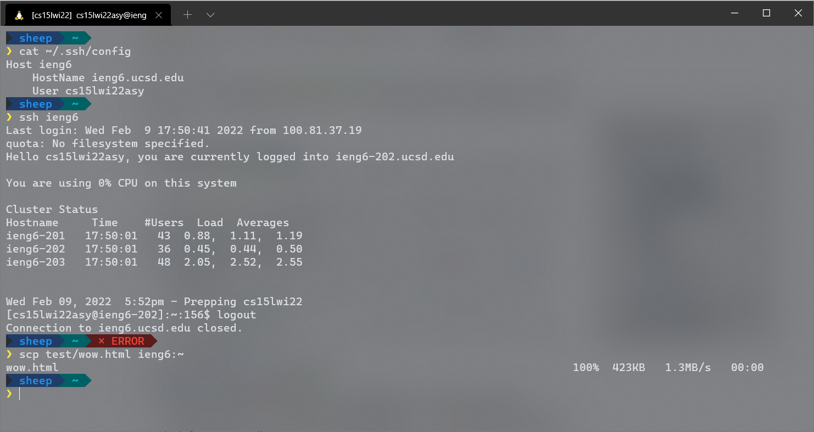

I edited my `~/.ssh/config` file using Vim by doing

```sh
$ vim ~/.ssh/config
```

Here is my `~/.ssh/config` file, me logging into my account using just the alias
I chose with an `ssh` command, and me copying a file using just the alias I
chose with an `scp` command.



My `~/.ssh/config` file contains what I assume is the alias (`ieng6` in my case)
after `Host` and then `HostName` and `User` from the SSH URL
`<User>@<Hostname>` I had used before.

To log in and copy files, I can use the `ssh` and `scp` commands I have used
before, but replace all mentions of `cs15lwi22asy@ieng6.ucsd.edu` with just
`ieng6`, my alias.
